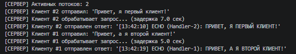
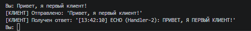
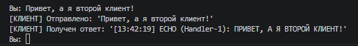

# Практическая работа 3: Разработка многопоточного сервера для параллельной обработки запросов

---
**Дисциплина:** Распределенные системы\
**Выполнил:** Верещак Д.Д\
**Группа:** 23-ПИ-01\
**Преподаватель:** Алешин Александр Владимирович

---
## 📋 Описание проекта
Данный проект реализует многопоточный TCP-сервер на языке Python с использованием библиотеки `threading`. Сервер способен обслуживать нескольких клиентов одновременно, где каждый клиент обрабатывается в отдельном потоке. Реализована имитация "тяжёлых" вычислений для демонстрации преимуществ многопоточной архитектуры.

---
## 🎯 Цель работы
Изучить механизмы конкурентности в сетевых приложениях и реализовать многопоточный TCP-сервер, способный обслуживать нескольких клиентов одновременно.

---
## 📁 Структура проекта

```
├── Server.py          # Серверная часть
├── Client.py          # Клиентская часть
├── README.md          # Документация
└── screenshots/       # Папка для скриншотов
```

---
## 🛠 Технологический стек
- **Python 3.10+**
- **TCP (stream sockets)**
- **Многопоточный режим работы (несколько клиентов)**
- **0.0.0.0 (все интерфейсы)**
- **Порт 65432**
- **Кодировка UTF-8**
- **Имитация задержки (5 сек.)**
- **Библиотеки socket, threading, time**

---
## 🚀 Инструкция по запуску
**Шаг 1: Проверка установленной версии Python**

**Откройте терминал (командную строку) и выполните:**
```
python --version
```
**Шаг 2: Запуск сервера**
1. Откройте первый терминал
2. Перейдите в папку с проектом
3. Запустите сервер:
```
python Server.py
```
4. Сервер перейдёт в режим ожидания подключения:
```
============================================================
МНОГОПОТОЧНЫЙ ЭХО-СЕРВЕР
Адрес: 0.0.0.0:8888
Режим: Многопоточный (threading)
Имитация нагрузки: random(2-8) секунд
============================================================
Сервер запущен и ожидает подключений...
```

**Шаг 3: Запуск клиента**
1. Откройте второй терминал
2. Перейдите в папку с проектом
3. Запустите клиента:
```
python Client.py
```

4. Клиент подключится к серверу:
```
============================================================
МНОГОПОТОЧНЫЙ ЭХО-КЛИЕНТ
============================================================

Выберите режим работы:
1. Интерактивный режим (один клиент)
2. Стресс-тест (5 клиентов одновременно)
3. Выход

Ваш выбор (1-3): 
```

**Шаг 4: Выбор режима**
Выбираем интерактивный режим на двух терминалах с клиентом

**Шаг 5: Обмен сообщениями**
1. В окне клиента вводите текстовые сообщения
2. Наблюдайте за логами в обоих окнах
3. Сервер возвращает сообщения в верхнем регистре  

**Пример:**
```
Вы: Привет, я первый клиент!
[КЛИЕНТ] Отправлено: 'Привет, я первый клиент!'
[КЛИЕНТ] Получен ответ: '[13:42:10] ECHO (Handler-2): ПРИВЕТ, Я ПЕРВЫЙ КЛИЕНТ!'
```
**Шаг 5: Завершение работы**

**Для корректного завершения сеанса введите команду:**
```
exit (quit)
```
**Оба приложения закроют соединения и завершат работу.**

---

## 📸 Скриншоты работы
**Результат работы сервера**



**Результат работы клиента 1**



**Результат работы клиента 2**


